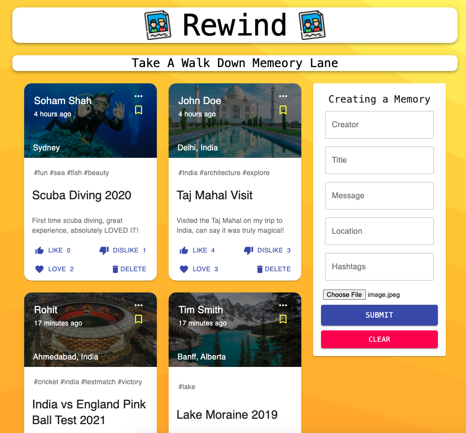

# Rewind

Developed a Memory Sharing Platform that allows users to upload their memories with pictures and interact with other peoples memories through likes, dislikes, love and bookmark feature. The web application was created using the MERN Stack

# Technologies Used

* ``` Node.js ```
* ``` React ```
* ``` MongoDB ```
* ``` Express ```
* ``` Redux ``` 
* ``` MaterialUI ```

# Check it Out

You can view the Application here: https://rewind-now.netlify.app/

<p align="center">
  
</p>
